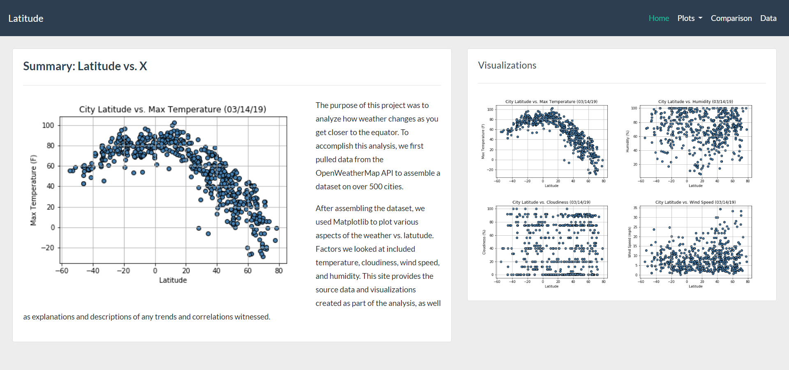
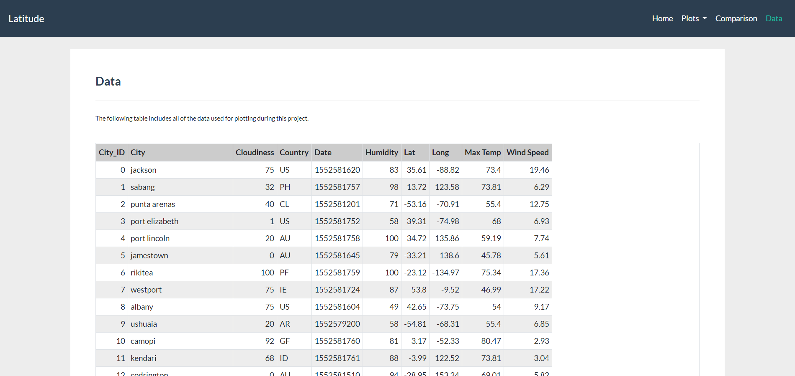

# Weather Changes Analysis

## Description  
Analysis of changes in weather with respect to distance from the equator, all data collected using the OpenWeatherMap API.  Summary statistics and visualizations created using Python, Pandas, and Matplotlib.

**Contents:**  
* html/  
  * bootstrap.min.css  
  * comparison.html  
  * data.html  
  * index.html  
  * latitude_vs_cloudiness.html  
  * latitude_vs_humidity.html  
  * latitude_vs_temperature.html  
  * latitude_vs_wind_speed.html  
  * reset.css  
  * style.css  
* output/  
  * cities.csv  
  * latitude_vs_cloudiness.png  
  * latitude_vs_humidity.png  
  * latitude_vs_max_temp.png  
  * latitude_vs_wind_speed.png
  * screenshot_dashboard.png  
  * screenshot_data.png  
* WeatherPy.ipynb